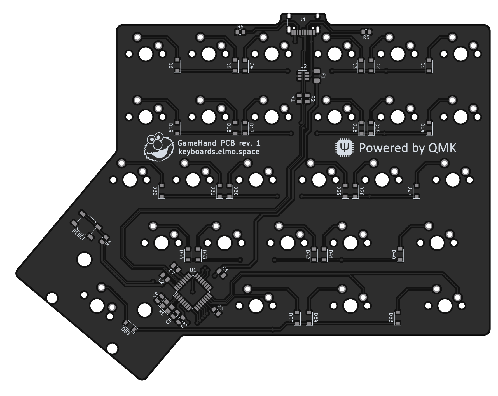
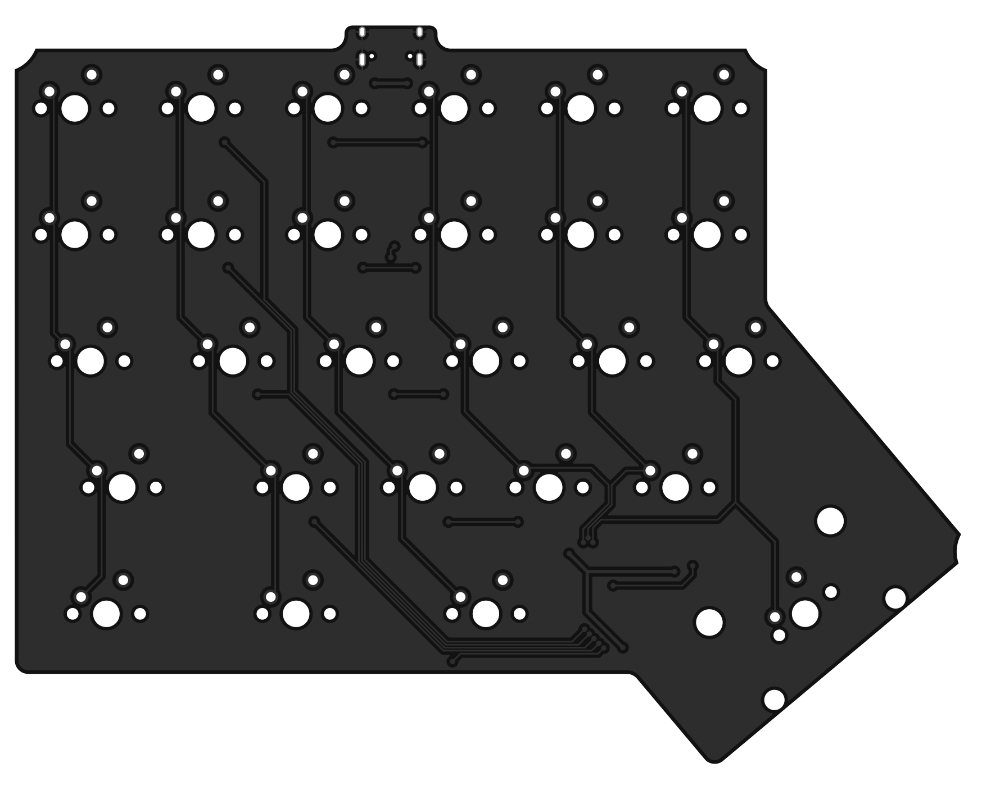

# GameHand PCB

---

The GameHand PCB is powered by an ATmega32u2 MCU and has basic ESD and overvoltage protection.  

With the firmware files in this repo the board is capable of full NKRO and 1000 Hz USB polling.

---

